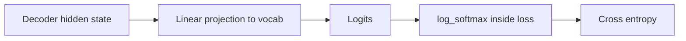
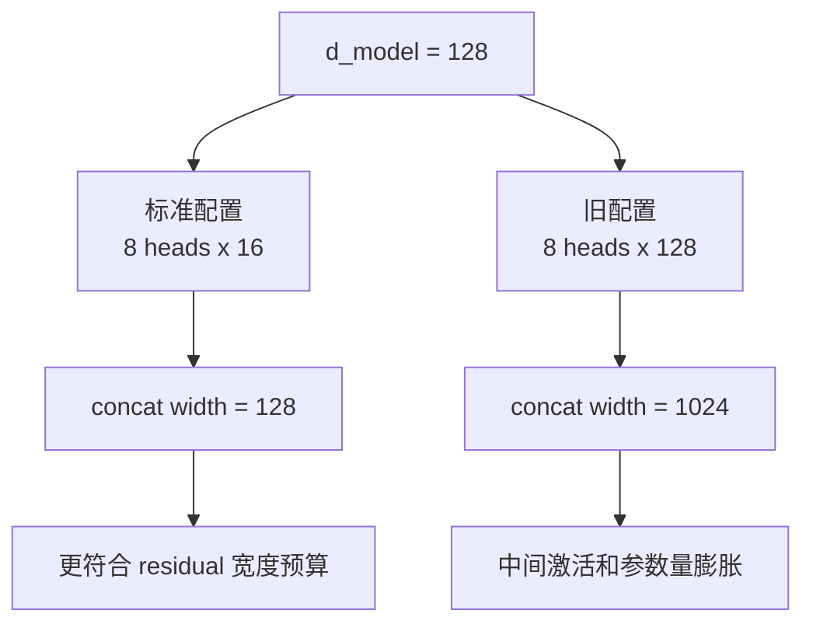
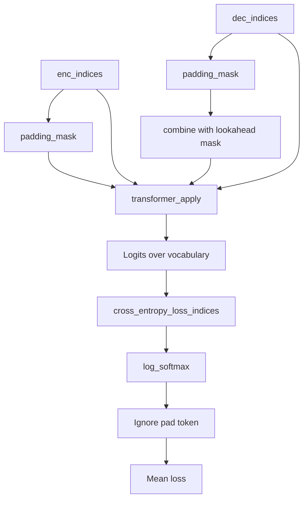

# JAX Transformer 流程图与关键说明

这份文档对应当前 `src/jax/transformer.py` 和 `src/jax/layer.py` 的实现，重点回答两个问题：

1. 为什么把 `d_k / d_v` 改小以后，训练反而更稳定。
2. 为什么去掉输出端的 `softmax`，但注意力里的 `softmax` 仍然保留。

---

## 1. 当前模型主干

```mermaid
flowchart TD
    A[Encoder tokens] --> B[Shared Embedding<br/>lin_o.T]
    B --> C[Positional Encoding]
    C --> D[Encoder Layer 1]
    D --> E[Encoder Layer 2]

    F[Decoder tokens] --> G[Shared Embedding<br/>lin_o.T]
    G --> H[Positional Encoding]
    H --> I[Decoder Layer 1]
    I --> J[Decoder Layer 2]

    E --> I
    E --> J

    J --> K[Linear to vocab logits<br/>lin_o]
    K --> L[Training loss:<br/>log_softmax + cross entropy]
    K --> M[Inference:<br/>argmax(logits)]
```

这里有两个容易混淆的点：

- `K` 输出的是 `logits`，不是概率。
- 训练时概率是在 loss 内部通过 `log_softmax(logits)` 隐式得到的。

---

## 2. 两种 softmax，不是同一个位置

### 2.1 注意力里的 softmax，必须保留

```mermaid
flowchart LR
    Q[Q] --> S[QK^T / sqrt(d_k)]
    K[K] --> S
    S --> M{Mask}
    M --> P[Softmax over keys]
    V[V] --> O[Weighted sum with V]
    P --> O
```

这层 `softmax` 的作用是把注意力分数变成一组归一化权重，让每个 query 对所有 key 的关注程度可比较。

如果去掉这里的 `softmax`，注意力机制本身就变味了，输出不再是标准的加权平均。

对应代码：

- `scaledDotProduct()` 在 `src/jax/layer.py`
- `scores -> softmax(scores) -> matmul(v)` 是标准 attention 路径

### 2.2 输出层的 softmax，不放在前向里



这里之所以不在 `transformer_apply()` 里先做一次 `softmax`，是因为训练时更稳定的做法是：

- 前向直接输出 `logits`
- loss 内部再做 `log_softmax`

原因是数值稳定性更好：

- `softmax` 后如果某些概率非常接近 `0` 或 `1`，再去取 `log`，更容易数值饱和。
- `log_softmax(logits)` 是深度学习里更标准也更稳定的写法。

所以现在的逻辑是：

- 训练：`linear -> logits -> log_softmax -> cross entropy`
- 推理：`linear -> logits -> argmax`

注意：

- `argmax(logits)` 和 `argmax(softmax(logits))` 完全等价
- 因为 `softmax` 不改变元素的大小顺序

---

## 3. 为什么 `d_k / d_v` 变小后效果更好

### 3.1 标准多头注意力的宽度预算

通常多头注意力是：

- 总模型宽度固定为 `d_model`
- 再把这条总宽度分给 `n_heads`

也就是常见设计：

- `d_k = d_v = d_model / n_heads`

对当前模型：

- `d_model = 128`
- `n_heads = 8`
- 所以标准配置应当是 `d_k = d_v = 16`

---

### 3.2 旧配置为什么会过大

旧配置里每个 head 都取：

- `d_k = 128`
- `d_v = 128`

于是多头拼接后的总宽度变成：

- `8 * 128 = 1024`

而不是和 residual stream 对齐的 `128`。

可以画成下面这样：



这会带来几个直接后果：

- 注意力投影层参数量明显变大。
- attention 输出先扩到 `1024`，再压回 `128`，优化更难。
- 在共享 embedding/output 权重且初始化偏大的情况下，logits 很容易被放大。
- logits 一旦过大，输出分布很快变成接近 one-hot，梯度就容易塌掉。

所以这里不是“更小一定更强”，而是：

- 旧配置已经超出合理宽度预算，训练稳定性明显变差。
- 改回标准 head 维度后，模型容量虽然变小，但优化难度大幅下降。
- 对这个加法 toy task，稳定可训练比盲目加宽更重要。

---

## 4. 当前训练路径的真实数据流



这就是当前实现里“没有显式输出概率，但训练完全正常”的原因：

- 概率分布不是没了
- 而是被放进 loss 内部，以更稳定的形式计算

---

## 5. 一句话总结

- 注意力里的 `softmax` 是 attention 机制的一部分，必须保留。
- 输出层不需要在前向里显式 `softmax`，训练时直接用 logits 做交叉熵更稳定。
- `d_k / d_v` 改小不是因为“小更强”，而是因为原来的每头维度远超标准预算，导致数值尺度和优化难度一起失控。
